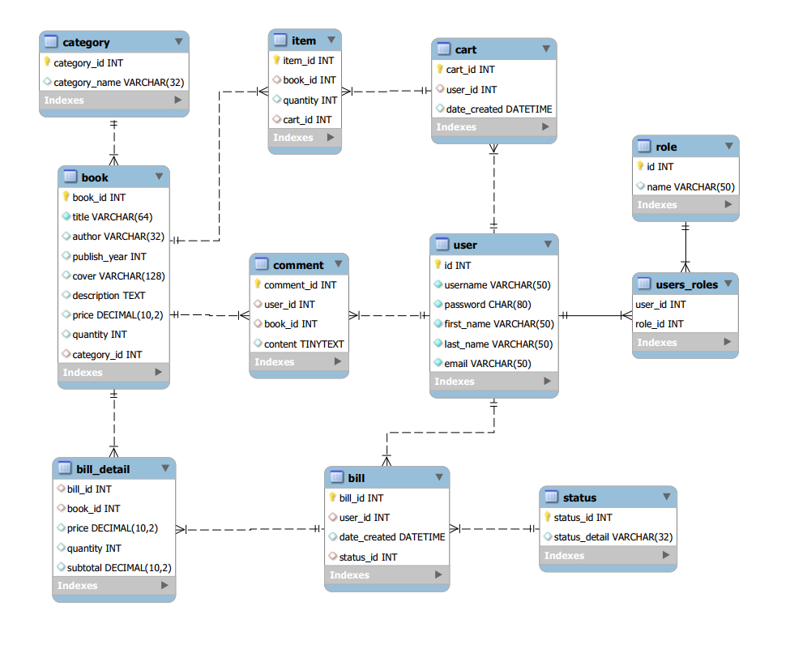
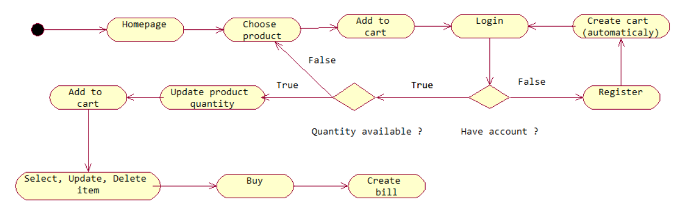

# Bookstore website using Spring MVC 

## Project name: Hogwarts bookstore

### 1. Overview
Perform basic business logic about _e-commerce website_
#### a. Database schema

#### b. Basic workflow

## 2. Prerequisites
* JDK 8 or higher
* IDE to use maven
* MySQL
* Tomcat server 

## 3. Installation

1. Edit _dependencies version_ compatible for yours
2. Import this maven project to IDE
3. Run with _tomcat_
